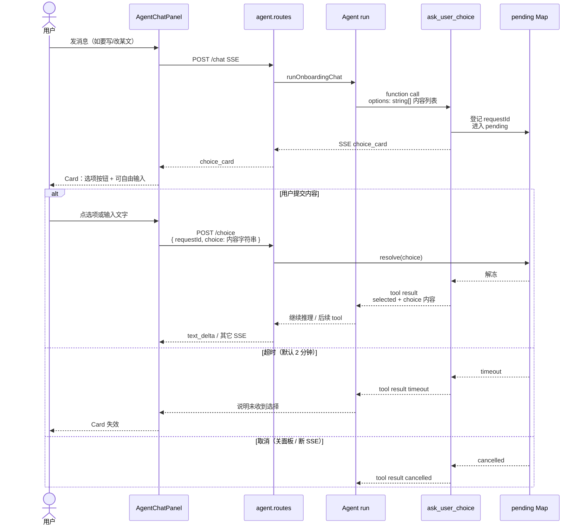
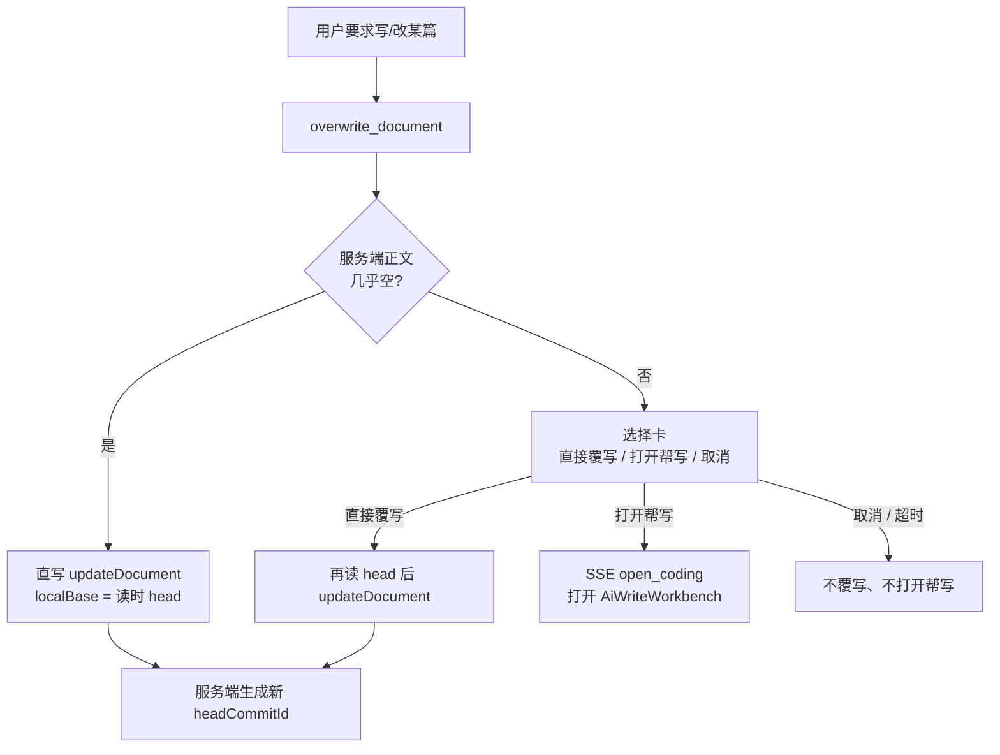

# Ask：用户选择 Card + 文档覆写

> 一句话：`ask_user_choice` 的 pending/解冻时序，以及有正文时 `overwrite_document` 如何让用户选「直接覆写 / 帮写 / 取消」。

## 选择 Card 时序（主图）

```mermaid
sequenceDiagram
  actor U as 用户
  participant UI as AgentChatPanel
  participant API as agent.routes
  participant Ag as Agent run
  participant T as ask_user_choice
  participant Pend as pending Map

  U->>UI: 发消息（如要写/改某文）
  UI->>API: POST /chat SSE
  API->>Ag: runOnboardingChat
  Ag->>T: function call<br/>options: string[] 内容列表

  T->>Pend: 登记 requestId<br/>进入 pending
  T-->>API: SSE choice_card
  API-->>UI: choice_card
  UI-->>U: Card：选项按钮 + 可自由输入

  alt 用户提交内容
    U->>UI: 点选项或输入文字
    UI->>API: POST /choice<br/>{ requestId, choice: 内容字符串 }
    API->>Pend: resolve(choice)
    Pend-->>T: 解冻
    T-->>Ag: tool result<br/>selected + choice 内容
    Ag-->>API: 继续推理 / 后续 tool
    API-->>UI: text_delta / 其它 SSE
  else 超时（默认 2 分钟）
    Pend-->>T: timeout
    T-->>Ag: tool result timeout
    Ag-->>UI: 说明未收到选择
    UI-->>U: Card 失效
  else 取消（关面板 / 断 SSE）
    Pend-->>T: cancelled
    T-->>Ag: tool result cancelled
  end
```

## 写作意图总览（空文直写 / 有正文选路径）

```mermaid
flowchart TD
  A[用户要求写/改某篇] --> B[overwrite_document]
  B --> C{服务端正文<br/>几乎空?}
  C -->|是| D[直写 updateDocument<br/>localBase = 读时 head]
  D --> E[服务端生成新 headCommitId]
  C -->|否| G[选择卡<br/>直接覆写 / 打开帮写 / 取消]
  G -->|直接覆写| D2[再读 head 后 updateDocument]
  D2 --> E
  G -->|打开帮写| I[SSE open_coding<br/>打开 AiWriteWorkbench]
  G -->|取消 / 超时| J[不覆写、不打开帮写]
```
