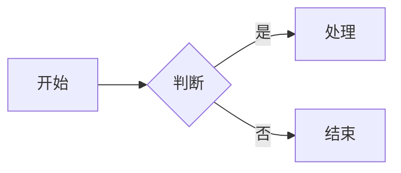

# mdocs - 面向小团队的 Markdown 知识库


> 一个轻量级、自托管的 Markdown 知识库，专为小团队协作设计。访客身份无需注册，数据存储在本地，支持富文本编辑、图表、数学公式等多种功能。

## ✨ 核心特性

### 📝 富文本编辑
- 基于 Lexical 的现代化编辑器，支持所见即所得
- 原生 Markdown 语法支持，兼容标准 Markdown
- **Markdown 粘贴**：直接粘贴 Markdown 内容自动解析为富文本
- 实时预览：编辑时实时渲染效果
- 自动保存：编辑内容自动保存到本地

### 🎨 多种图表支持

#### Mermaid 流程图

- 支持流程图、序列图、甘特图、类图等 10+ 种 Mermaid 图表
- 实时编辑预览，支持缩放拖拽

#### Markmap 思维导图
```markmap
# 根节点
## 子节点 1
### 子子节点 1
### 子子节点 2
## 子节点 2
```
- 基于 Markdown 语法的思维导图
- 支持折叠展开、一键展开全部
- 节点数超过 30 个时默认全部折叠，优化性能

#### Meta2d 业务图表
- 支持多种业务场景图表
- 拖拽式编辑，灵活定制
- 可导出为 SVG/PNG

#### Wardley 地图
```wardley
title 产品战略地图
component 客户 [0.95, 0.1]
component 数据 [0.8, 0.3]
component 算法 [0.7, 0.5]
```
- 战略分析专用图表
- 支持自定义组件和连线

### 🧮 数学公式
行内公式：$E = mc^2$

块级公式：
$$
\int_{-\infty}^{\infty} e^{-x^2} dx = \sqrt{\pi}
$$

- 基于 KaTeX 的高性能渲染
- 支持 LaTeX 语法
- 行内和块级公式均支持

### 📁 文档组织
- **树形结构**：无限层级文件夹，支持拖拽排序
- **文件夹描述**：每个文件夹可设置 `___desc___.md` 作为目录介绍
- **我的文档**：按所有者过滤查看自己创建的所有文档
- **书签收藏**：重要文档可加入收藏，快速访问

### 👥 团队协作
- **访客身份系统**：无需注册，设置昵称即可开始创作
- **密码登录**：支持设置密码，跨设备登录同一账号
- **恢复码**：账号丢失时可通过恢复码找回
- **评论功能**：文档支持评论互动
- **文档邀请**：可邀请特定访客编辑或查看文档
- **权限控制**：
  - 🔒 私有：仅作者可见
  - 👁️ 域内只读：当前域所有成员可读
  - ✏️ 域内可写：当前域所有成员可编辑
  - 🌐 公开只读：所有人可读
  - ✏️ 公开可写：所有人可编辑

### 🏷️ 多域隔离
- 支持创建多个独立知识库（域）
- 每个域有独立的文档树、成员列表和权限设置
- 域之间数据完全隔离，适合不同项目/部门使用
- 支持域成员模板，批量添加成员

### 🔑 CLI 访问
- 生成 CLI Token，支持通过命令行访问 API
- 可用于自动化脚本、CI/CD 集成
- 支持 Token 吊销和重新生成

### 🎭 Demo 模式
- 无需启动后端服务，直接在浏览器中体验完整功能
- 数据存储在浏览器 IndexedDB 中，刷新不丢失
- 支持所有核心功能（编辑、评论、收藏等）
- ⚠️ Demo 模式提示：请勿长期存储重要数据

### 📱 响应式设计
- 桌面端、平板、手机均适配
- 左侧边栏可折叠，最大化编辑区域
- 目录大纲随滚动自动高亮

### 💾 数据存储
- **文档内容**：Markdown 文件存储在磁盘，可直接用其他编辑器打开
- **元数据**：SQLite 存储路径、权限、所有者等信息
- **附件**：图片、文件等上传到本地存储
- **可移植性**：文档文件可直接拷贝、Git 版本管理

## 🚀 快速开始

### 1. 安装
```bash
npm install -g @fgbg/mdocs
# 或
pnpm add -g @fgbg/mdocs
```

### 2. 启动服务
```bash
mdocs start
```

默认访问：`http://localhost:4000`

## 📊 技术栈

| 层级 | 技术选型 |
|------|----------|
| **前端** | React 19 + Vite + Antd + @lobehub/editor (Lexical) |
| **后端** | Node.js + Express |
| **数据库** | SQLite (better-sqlite3) |
| **存储** | 本地文件系统 + IndexedDB（草稿） |
| **图表** | Mermaid + Markmap + Meta2d + Wardley |
| **数学** | KaTeX |

## 📸 功能截图

| 功能 | 截图 |
|------|------|
| 富文本编辑器 |  |
| Mermaid 流程图 |  |
| Markmap 思维导图 |  |
| 数学公式 |  |
| 文档树 |  |
| 评论系统 |  |
| 设置页面 |  |

## 🎯 适用场景

- ✅ 小团队内部知识库
- ✅ 项目文档管理
- ✅ 个人笔记系统
- ✅ 产品需求文档
- ✅ API 文档
- ✅ 会议记录

## 📄 License

MIT © fgbg
