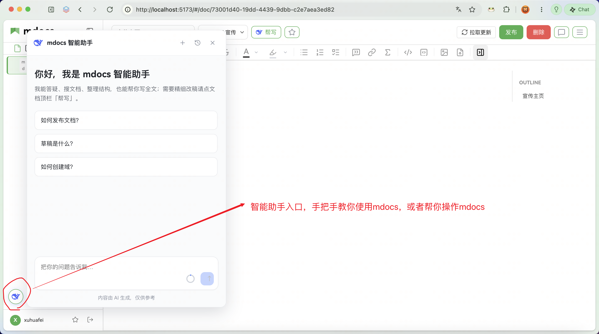
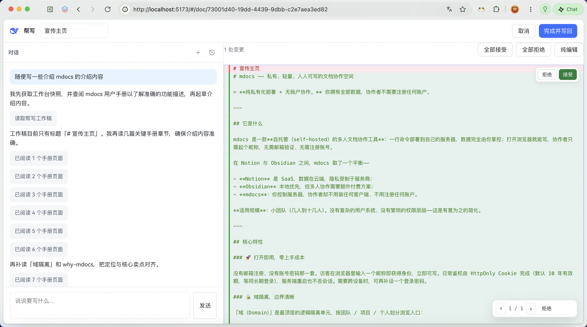
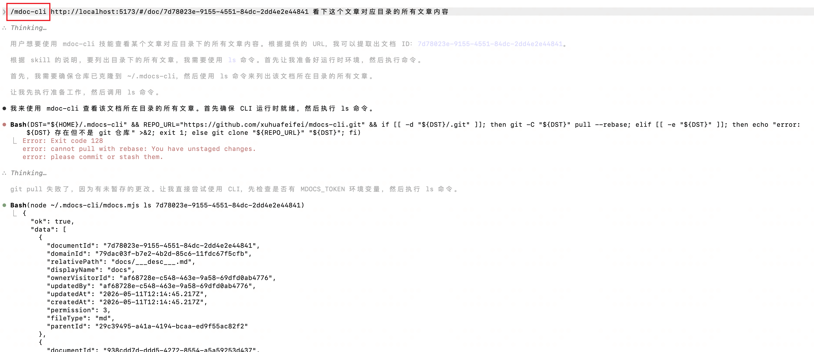
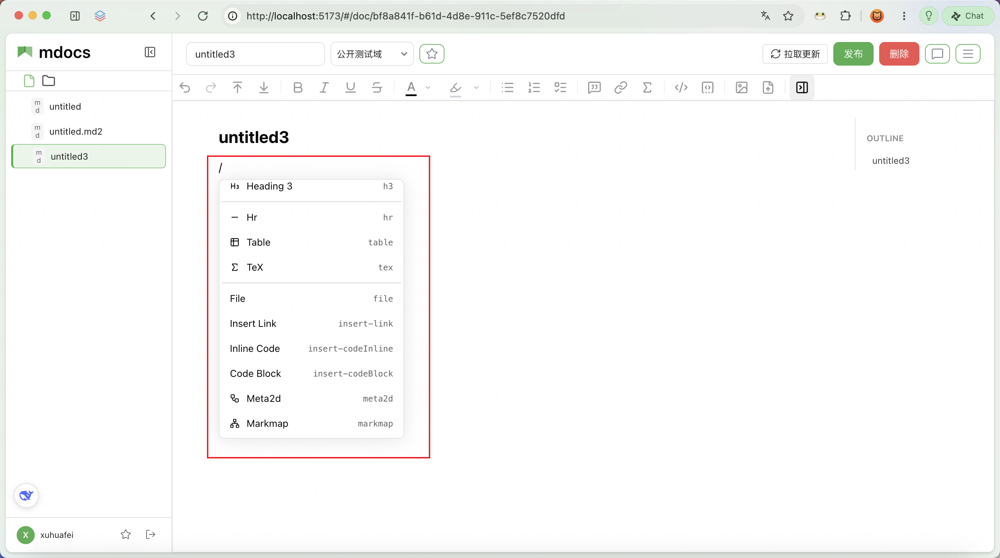
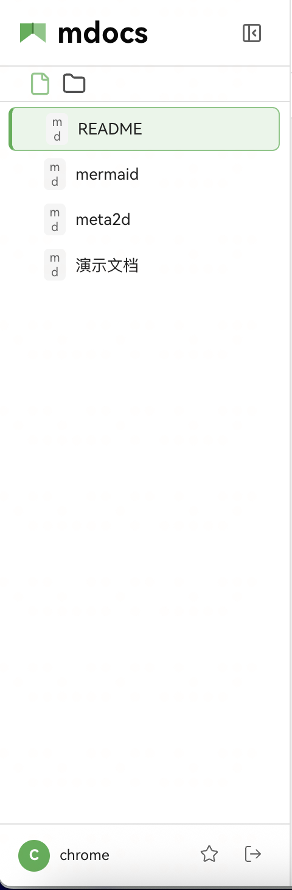
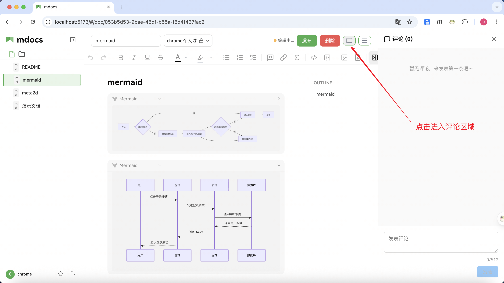

# mdocs

**开源 Markdown 知识库** — 给人用，也给 Agent 用。

面向个人开发者与小团队：产品内 **智能助手 + 帮写**，外部 **CLI / Skills** 接入 Cursor / Claude；SQLite + 本地文件，**无账户**即可协作。

[文档站点](https://xuhuafeifei.github.io/mdocs-site/) · [GitHub](https://github.com/xuhuafeifei/mdocs) · [npm `@fgbg/mdocs`](https://www.npmjs.com/package/@fgbg/mdocs) · 当前版本 **0.8.17**

<p align="center">
  
</p>

## 为什么选 mdocs

| 能力 | 说明 |
|------|------|
| **AI 双模式** | **智能助手**：答疑、搜文、结构操作、有条件全文覆写（低交互），帮你省操作时间。**帮写**：左聊右 Diff、按段接受后再写回（高交互），精细控制每一段文字。 |
| **Agent 开发闭环** | CLI Token + [mdocs-cli](https://github.com/xuhuafeifei/mdocs-cli) Skills：在 Cursor / Claude 里搜索、读写知识库；`mdocs-dev` / `diagram` 把契约与 Mermaid 落进仓库，减少决策不落盘与知识漂移。 |
| **本地私有** | 单进程，SQLite + 磁盘文件，无外部 DB / 缓存 / 队列。 |
| **无账户协作** | 访客即身份；域隔离 + 文档级邀请，从私有到开放按需放开。 |
| **双模编辑与草稿** | Markdown + 富文本工具栏；Meta2d / Mermaid / Markmap；本地草稿自动保存，空闲可同步云端。 |

<p align="center">
  
</p>

## 快速开始

```bash
npm install -g @fgbg/mdocs
mdocs
# 浏览器打开 http://localhost:4000
```

临时体验：

```bash
npx @fgbg/mdocs
```

需要 **Node.js 22+**。更细的安装（含低内存机器 Swap 说明）见 [文档 · 安装](https://xuhuafeifei.github.io/mdocs-site/docs/getting-started/installation.html)。

## 功能速览

### 智能助手

左下角悬浮入口（可拖动）：答疑、搜文、建空文档 / 文件夹、移动文档。已有正文时写作会弹出选择卡：**直接覆写 / 打开帮写审阅 / 取消**。

<p align="center">
  
</p>

DeepSeek API Key 在设置页配置（按访客隔离）：

<p align="center">
  
</p>

### 帮写

顶栏 **帮写** 进入全屏工作台：左 AI、右 Markdown Diff，按段接受 / 拒绝后再「完成并写回」。改稿前可查手册 skill、读工作稿，避免盲改。

<p align="center">
  
</p>

### Agent / CLI

为 Agent 准备 CLI Token 后，可用 Skills 读写知识库（不必背完整命令，粘贴文章 URL 即可）。

<p align="center">
  
</p>

详见：[Agent 开发闭环](https://xuhuafeifei.github.io/mdocs-site/docs/usage/agent-dev-loop.html) · [CLI Token](https://xuhuafeifei.github.io/mdocs-site/docs/usage/cli-token.html)

### 编辑、域与协作

斜杠菜单插入 Meta2d / Markmap 等；域管理、评论、收藏等能力齐全。

<p align="center">
  
  
</p>

<p align="center">
  
  
</p>

## 从源码开发

```bash
git clone https://github.com/xuhuafeifei/mdocs.git
cd mdocs
pnpm install
pnpm dev          # API :4000 + Vite :5173（代理 /api）
```

```bash
pnpm build && pnpm start   # 生产：同端口提供静态资源与 API
pnpm test
pnpm typecheck
pnpm mdocs visitor list    # 管理 CLI（开发用 tsx 入口）
```

仓库布局：

```
src/
  server/    Express API、Agent、文档/域服务、CLI
  web/       Vite + React 前端
  shared/    两侧共用类型与路径工具
```

## 运行时数据

默认目录 `~/.mdocs/`（可用 `MDOCS_DATA_DIR` 覆盖）：

```
~/.mdocs/
  sqlite/data.sqlite
  files/docs/          # 文档内容
  files/assets/        # 附件
  logs/
```

`domain_id` 只存在于 SQLite，**不会**出现在文件路径里。

## 访客身份与迁移

首次访问输入昵称 → 获得 `visitor_id` + 高熵 token；浏览器存明文，服务端只存 `SHA-256(token)`，请求头 `x-visitor-token`。

清缓存后重新注册可用迁移合并身份：

```bash
mdocs visitor migrate --from Alice --to Bob --dry-run
mdocs visitor migrate --from Alice --to Bob --confirm
```

## 相关链接

| | |
|--|--|
| 产品文档 | https://xuhuafeifei.github.io/mdocs-site/ |
| 文档源码站 | https://github.com/xuhuafeifei/mdocs-site |
| CLI / Skills | https://github.com/xuhuafeifei/mdocs-cli |
| 问题反馈 | https://github.com/xuhuafeifei/mdocs/issues |

截图：[`image/`](./image/) 为最新实拍；[`docs/screenshots/`](./docs/screenshots/) 另有站点素材补充。

## License

[MIT](./LICENSE)
